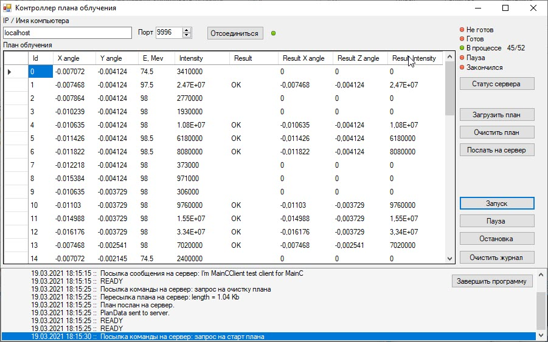

# MainCClient.NET

Программа-клиент для отсылки плана облучения на сервер:
- загружает план облучения из файла
- отсылает план облучения на удалённый сервер 
- запускает облучение, с возможностью приостановки, продолжения и отмены
- получает результаты облучения

Программа использует библиотеку **TMClient.dll** для обмена данными по протоколу **TM**.

